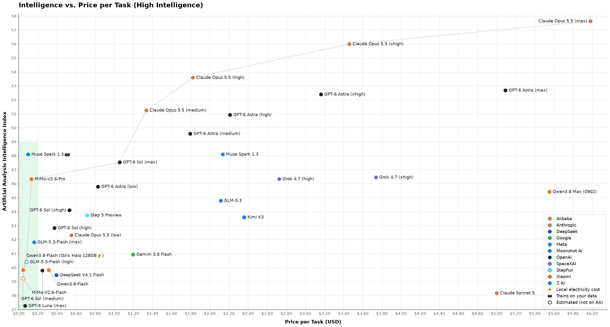
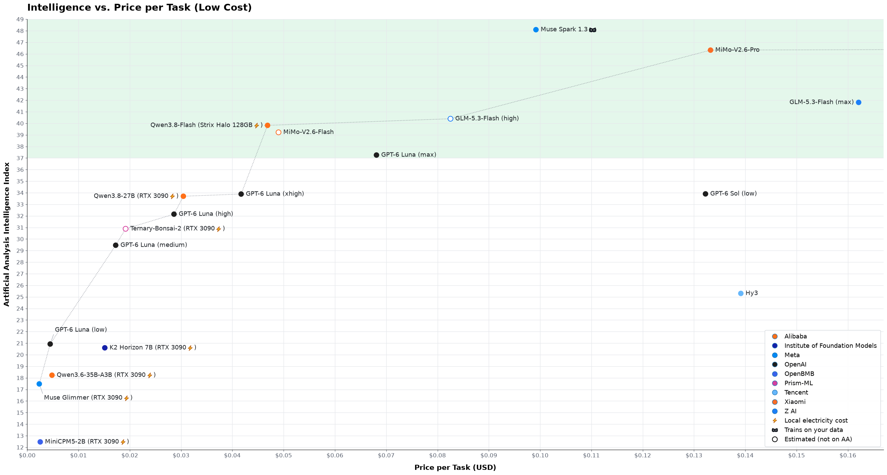
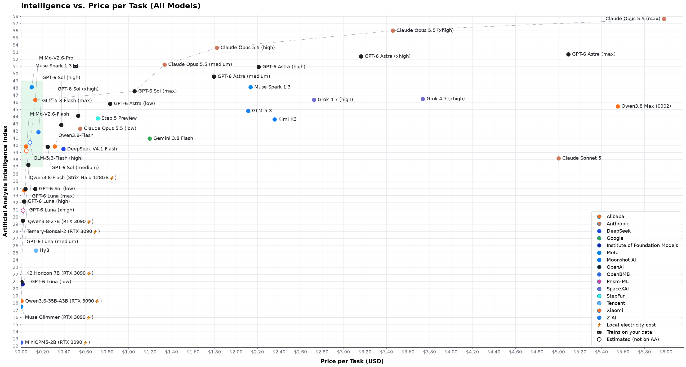
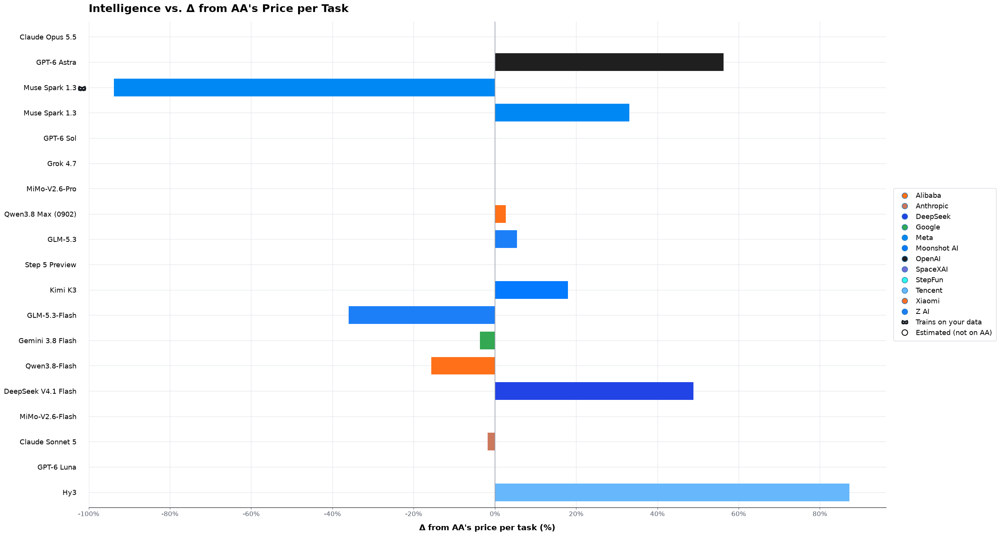

# LLMs: Intelligence vs. cost

**Last updated:** 2026-09-23

[ArtificialAnalysis](https://artificialanalysis.ai) is a website that benchmarks the
intelligence of various LLM models. They publish a headline _Intelligence Index_, which
is calculated as the mean output of the curated selection of benchmarks they run on each
model. It's a decent finger-in-the-air measure of how smart a model is overall.

AA also records useful information — namely, how much it cost them to run the
benchmarks. Since the benchmarks are the same across all models, this offers a good
indicator of how much it will cost a user to run each model, in relative terms.

One of their main plots is the [Intelligence vs. cost
plot](https://artificialanalysis.ai/#intelligence-comparison-tabs), which shows the
Pareto frontier, i.e. the cheapest model that can achieve each intelligence score. This
frontier is important, because using a super-intelligent and super-expensive model to
accomplish menial tasks that could be done by a much dumber and cheaper one is just a
waste of money.

Over time, I've become progressively more irritated by this plot, for a few reasons.

## Why AA's plot is misleading

The first issue I have with it is that it uses a logarithmic scale on the cost axis.
Using a log scale is the only way to make you spot the difference between a model that
costs $0.010 per task and one that costs $0.019, while the same plot contains a model
that costs $7.63 — over 700 times as expensive. However, the net result is that the
viewers can no longer appreciate the immensity of the price difference between the cheap
models and the heavy ones; nor can they realize how inconsequential the price
differences are between the cheap models.

The second thing that irks me is that it calculates the cost of each task using the
official pricing from the model developers' own API offering. Posted prices are
routinely undercut by what customers actually pay: input cache hit rates fluctuate
substantially over time, some providers sell the exact same weights much cheaper, and
open-weights models in particular can be rented for a fraction of the list price.
[OpenRouter](https://openrouter.ai) publishes the posted prices of every provider and —
more interestingly — the average price its customers _actually_ paid for each model,
which is what my plots are built on.

The third and final issue is that local models — those that can fit on consumer hardware
— appear on the plot at their datacenter pricing, which is always very expensive in
proportion to the intelligence you buy with it and ultimately not something any real
user will actively want to buy.

## I made my own plots

All intelligence index scores are from ArtificialAnalysis. All points are
benchmarked at maximum thinking effort where not explicitly stated otherwise.

The X axis shows the cost of one Artificial Analysis Intelligence Index task, derived
from AA's benchmark task size and what OpenRouter's users actually pay for a real
agentic session rather than from the developers' sticker prices. Later in the document
I explain how I calculated these numbers.

In the first plot we see the current offering with the most intelligent (and expensive)
models.

A good rule of thumb for reading the intelligence axis: a one-point difference is
unlikely to be noticeable by most, while a 5-point gap is substantial. It's important to
point out that an intelligence score of 37, which is the rock bottom in this first plot,
is substantially above what the smartest model in the world could deliver in February
2026 (Opus 4.6, score 32).

Models marked with a thief mask symbol
()
train on your data and you should not use them for anything that you would not
want to become publicly available on the internet.

Models that ArtificialAnalysis has not measured are drawn as hollow circles; their
positions are extrapolated or estimated (the details are in the list of differences
below).

<a href="https://raw.githubusercontent.com/crusaderky/llm-intelligence-cost-plot/main/plots/high_intelligence.svg"></a>

The green area at the bottom left is where models become _extremely_ cheap. Let's zoom
into it and extend the intelligence plot a bit lower, down to what can run today on a
smartphone.

Some models are marked with a yellow lightning-bolt symbol (⚡). It means that the cost
was calculated as the electricity to run the model locally (details on the calculation
below), since the model is so small that it makes no sense to serve it from a
datacenter. When comparing local models against each other, it also offers a scale of
how long each model takes to complete tasks.

<a href="https://raw.githubusercontent.com/crusaderky/llm-intelligence-cost-plot/main/plots/low_cost.svg"></a>

Let's merge the two plots together to better visualize the diminishing returns
in performance/cost. Again, the area that's common to all plots is highlighted in green:

<a href="https://raw.githubusercontent.com/crusaderky/llm-intelligence-cost-plot/main/plots/all_models.svg"></a>

This is how much each datacenter model's real price per task deviates from the price
ArtificialAnalysis published for it. To the left of zero the OpenRouter reality is
cheaper than AA's sticker price, to the right it is more expensive. Local models are
absent as they have no sticker price to compare with.

<a href="https://raw.githubusercontent.com/crusaderky/llm-intelligence-cost-plot/main/plots/price_delta.svg"></a>

## All the differences between AA's plot and mine

- Changed x scale from logarithmic to linear, because people's money is not logarithmic
- Replaced AA's cost-per-task (the developers' posted prices applied to AA's benchmark
  token mix) with the real cost of the same task as measured on OpenRouter, described
  below
- Changed sub-200-billion-parameter models from datacenter pricing to cost to run locally
  (read below)
- Extrapolated points for GLM-5.3-Flash at high reasoning effort, by crossing AA scores
  at max effort with [Z.ai's coding scores](https://z.ai/blog/glm-5.3-flash) at
  different effort levels
- Extrapolated Ternary-Bonsai-2's intelligence as ~92% of Qwen3.8-27B's, as reported
  by [ByteShape](https://byteshape.com/blogs/Qwen3.8-27B/)
- Estimated MiMo-V2.6-Flash's point (not on AA yet): intelligence as Pro's AA score
  times the geometric mean of the 16 flash/pro benchmark score ratios Xiaomi
  published at [mimo.xiaomi.com/mimo-v2-6](https://mimo.xiaomi.com/mimo-v2-6), and
  cost per task as Pro's AA cost per task scaled by Xiaomi's nominal flash/pro
  price ratios

## Cost calculation for datacenter models

The **price per task** for datacenter models is built from what OpenRouter's customers
actually pay, using two observed statistics:

- **OpenRouter's session cost for 10–49 turns** — the median cost of a real agentic
  session of 10–49 turns (the "core" bucket on OpenRouter's session-cost leaderboard),
  averaged over the OpenRouter coding harnesses that carry session data for the model.
  This is a stable measure of real spending: per-provider list prices are not reliable
  (degraded or abnormally slow endpoints, discounts and routing keep moving them).

- **OpenRouter's weekly tokens served** — how many prompt and completion tokens
  OpenRouter served for the model over the trailing week, across all its variants. This
  is the weight with which the model enters the average below.

Session cost is dollars per _session_, not dollars per _task_, so it needs a
tokens-per-session conversion. AA's cost per task and OpenRouter's session cost share
the model's real price per token, so the ratio of the two estimates that number, and the
volume-weighted mean over all models is the conversion constant K:

```text
K = volume-weighted mean of (AA output tokens per task × OR session cost / AA cost per task)
price per task = AA output tokens per task × OR session cost / K
```

Calibrating K on AA's prices pins the volume-weighted average of
`price-per-task / AA-cost-per-task` to 1, so the plot keeps AA's overall dollar level
while its relative shape follows real spending. In other words: **the price is
proportional to what the model needs to answer one benchmark task at its own verbosity,
relative to what the average token served through OpenRouter costs.** A model whose real
price per token is above the volume-weighted average moves right of AA's sticker price;
a cheaper one moves left. A model with no 10–49-turn session data on OpenRouter keeps
AA's cost per task, unscaled.

## Cost calculation for local models

Price per task for models marked with the lightning-bolt symbol (⚡) was crudely
calculated as follows:

- Take Output tokens per task [from
  artificialanalysis.ai](https://artificialanalysis.ai/#intelligence-comparison-tabs)
- Crudely observe decode speed (tok/s) on local hardware. Most measurements were taken
  on the same RTX 3090 video card from 2020, which today is relatively affordable at
  ~$1,400 (used).
- Measure delta between peak and idle energy draw on said hardware
- Price electricity at $0.2049/kWh, which is the US residential electricity price,
  weighted average by population, as of May 2026.
- Add 20% (finger-in-the-air) for uncached input tokens and waiting for tool calls
- Hardware is priced at zero, on the basis that both an RTX 3090 PC and a 64GB Strix
  Halo are desirable gaming/work machines anyways.

Note that there isn't a material difference in electricity costs between different
hardware platforms: a Strix Halo draws less power than an RTX 3090, but it's slower so
it needs to run longer to complete the same tasks.

## Larger local models

Not including the cost of hardware stops being defensible once you upgrade beyond 64 GB
RAM, as almost nobody needs that much RAM if not for AI.

Qwen3.8-Flash needs, as a minimum, a 128GB Strix Halo to run locally. It appears twice
on the plot: once with datacenter pricing and once with the ⚡ symbol for local
electricity cost. The latter hides a substantial hardware expense: a 64 GB Strix Halo,
which is a very desirable general purpose mini PC, costs $2,200; a 128 GB one costs
$3,800 and doesn't enable anything other than AI models in the ~120B-parameter class.

The following models _can_ be run locally, but carry a very steep up-front hardware
cost:

| RAM requirements | Hardware | Price | Models |
| --- | --- | --- | --- |
| 96 GB | Strix Halo 128 GB<br>DGX Spark (128 GB)<br>Mac Studio M5 Max 128 GB<br>Mac Studio M5 Ultra 96 GB<br>MacBook Pro M5 Max 128 GB<br>PC with RTX 6000 Pro | $3,800<br>$5,000<br>$5,100<br>$5,400<br>$7,000<br>~$16,000 | Qwen3.8-Flash<br> |
| 192 GB | Gorgon Halo | T.B.A. ~$7,000 | MiMo-v2.6-Flash |
| 256 GB | 2x DGX Spark<br>Mac Studio M5 Ultra 256 GB | $10,200<br>$11,300 | GLM-5.3-Flash |
| 280 GB | 3x DGX Spark (384 GB) | $15,300 | DeepSeek-V4.1-Flash |
| 512 GB | 4x DGX Spark + QFP28 switch<br>2x Mac Studio M5 Ultra 256 GB<br>Mac studio M5 Ultra 512 GB | $21,200<br>$22,600<br>T.B.A. | GLM-5.3 |
| 640 GB | 5x DGX Spark + 2x QFP28 switch | $27,200 | MiMo-v2.6-Pro |
| 2 TB | 2x TensTorrent Galaxy Blackhole | $320,000 | Kimi K3 |

## Conclusion

There is an immense difference in cost between the state-of-the-art models from
Anthropic and OpenAI and the much cheaper Chinese models: the former are [too expensive
even for large
corporations](https://www.tomshardware.com/tech-industry/artificial-intelligence/ai-cost-crisis-hits-tech-giants-as-employee-tokenmaxxing-backfires-agentic-ai-eats-up-to-1000x-more-tokens-than-standard-ai-sparks-corporate-pullback-at-microsoft-meta-and-amazon),
while the latter can be as cheap as a mobile phone subscription.

How much extra intelligence emptying the wallet purchases obeys the law of diminishing
returns: while a top-tier engineer or scientist is probably going to be able to
appreciate how much better Claude Opus 5.5 at max effort (intelligence score 58,
$5.98/task) is compared to GLM-5.3 (intelligence 45, $2.11/task — 3x cheaper), most
people will have a hard time doing so. Going further down, GLM-5.3-Flash at max effort
(intelligence 42, $0.16/task — almost _forty times_ cheaper than Opus 5.5) is visibly
less capable when you give it very
sophisticated tasks, like one-shotting a whole coding project on its own, but it remains
_enough_ for 90% of what people actually need. Even the highly specialized engineers and
scientists mentioned above don't actually need the extra intelligence for a lot of what
they do. Descending just a little bit further, an enthusiast gamer can run Qwen3.8-27B
(intelligence 34, $0.03/task in electricity) on a computer they already own.
