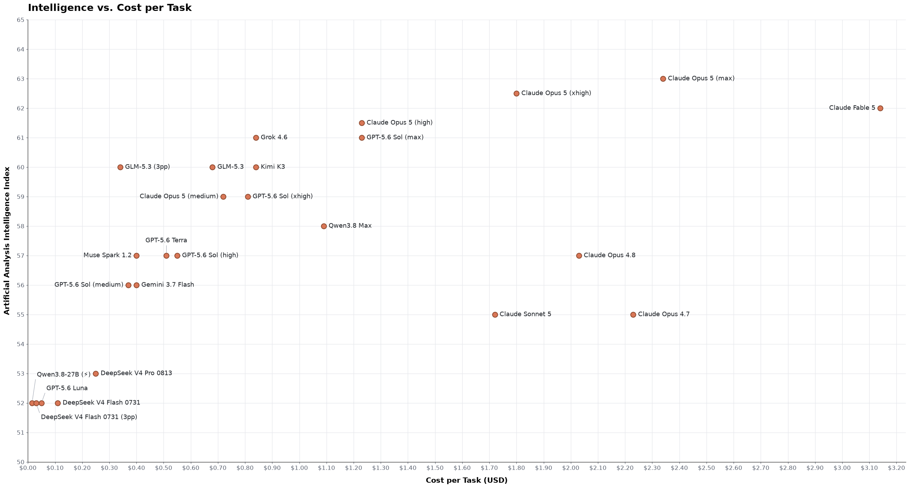

# LLMs: Intelligence vs. cost plot



**Last updated:** 2026-08-20.

I think that [ArtificialAnalysis's intelligence/cost plot](https://artificialanalysis.ai/#intelligence-comparison-tabs) is seriously misleading, so I decided to make my own. Note that unlike AA, this page is not going to be updated frequently.

All points are at max thinking where not explicitly stated. All intelligence index
scores are from AA. All cost scores are from AA too except where noted below.

## Why AA's plot is misleading

- It uses the official pricing from the developers, which, for GLM and DeepSeek V4 Flash, is a lot more expensive than what you can get them for on OpenRouter;
- It does not make you appreciate the immensity of the price difference between the cheap models and the heavy ones;
- It does not make you appreciate how inconsequential the price differences are between the cheap models.

## What changes between AA's plot and mine

- Changed X scale from logarithmic to linear, because people's money is not logarithmic
- Added DeepSeek V4 Flash 0731 as it is priced today by third party providers on OpenRouter (note: you don't get this today with OpenCode Go/Zen, but it's been promised you will soon).
- Added GLM-5.3 as it will be priced by third party providers on OpenRouter in September 2026, assuming no license changes from 5.2. Note: you don't get this on OpenCode Go/Zen.
- Changed cost of Qwen3.8-27B from datacenter (which nobody uses) to locally hosted. Cost per task was crudely calculated from:

  - 47,166 output tok/task (AA)
  - tg 55 tok/s @ 350W, as crudely observed on my RTX3090 (IQ4_XS shows negligible quality loss)
  - US median residential electricity price as of 2026-08-20
  - +15% (finger-in-the-air) for uncached input tokens and waiting for tools.
  - Hardware priced at 0, on the basis that both a RTX 3090 PC and a 64GB Strix Halo are desirable gaming/work machines anyways.

These maths are meant to produce a rough back-of-the-envelope figure and should not be taken authoritatively were you to zoom into the bottom-left corner of the chart. They don't want to answer how much cheaper it is to run Qwen at home vs. DSv4 on OpenRouter, because they are both so cheap that the difference is inconsequential for most of the population.

**Note:** not including the cost of hardware stops being defensible once you upgrade to a 128GB Strix Halo (almost nobody needs that much RAM if not for AI). This is why I did not add self-hosted DeepSeek IQ2_XXS to the chart; it would likely also sit lower on the intelligence axis than the MXFP4 native model. Same argument for a ~$16k rig needed to run GLM-5.3 IQ4 locally. I'm not saying they're not worth the expense (privacy is priceless), just that pegging them on the plot is a much more nuanced exercise.

## To regenerate the plot
```bash
pixi run plot
```
