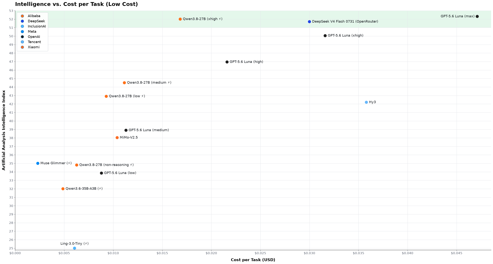

# LLMs: Intelligence vs. cost plots

**Last updated:** 2026-08-25

I think that [ArtificialAnalysis's intelligence/cost
plot](https://artificialanalysis.ai/#intelligence-comparison-tabs) is seriously
misleading - read below for why - so I decided to make my own.

Points are at max thinking where not explicitly stated. All intelligence index scores
are from AA. All cost scores are from AA too except where noted below.


Zoom into the bottom-left corner and add more local models. The ⚡ symbol means
electricity cost to run a local model, which is proportional to the time per task given
the same hardware (details below). The area displayed by both plots is <span
style="background-color:#E4F8EC;color:#1f2328">highlighted in green</span>.



## Why AA's plot is misleading

- It uses the official pricing from the model developers' own API offering which, for
  GLM and DeepSeek V4 Flash, is a lot more expensive than what you can get them for on
  OpenRouter;
- It does not make you appreciate the immensity of the price difference between the
  cheap models and the heavy ones;
- It does not make you appreciate how inconsequential the price differences are between
  the cheap models.

## What changes between AA's plot and mine

- Changed X scale from logarithmic to linear, because people's money is not logarithmic
- Added DeepSeek V4 Flash 0731 as it is priced today by third party providers on
  OpenRouter (note: you don't get this with OpenCode Go/Zen).
- Added GLM-5.3 as it will be priced by third party providers on OpenRouter in September
  2026, assuming no license changes from 5.2 (you don't get this either on OpenCode
  Go/Zen).
- Changed cost of <=35 billion parameters models from datacenter pricing (which nobody
  realistically will ever use) to cost to run locally.

## Cost calculation for local models

Cost per task for models marked with ⚡ was crudely calculated as follows:

- Take Output tok/task [from
  artificialanalysis.ai](https://artificialanalysis.ai/#intelligence-comparison-tabs)
- Crudely observe decode speed (tok/s) on a RTX 3090
- Assume 350W energy draw, which is typical for a RTX 3090 at 100% usage
- Use US residential electricity price, weighted average by population, as of May 2026
- Add 15% (finger-in-the-air) for uncached input tokens and waiting for tools
- Hardware is priced at 0, on the basis that both a RTX 3090 PC and a 64GB Strix Halo
  are desirable gaming/work machines anyways.

Not including the cost of hardware stops being defensible once you upgrade to a ~$3,600
128GB Strix Halo (almost nobody needs that much RAM if not for AI). This is why I did
not add self-hosted DeepSeek IQ2_XXS to the chart; it would likely also sit lower on the
intelligence axis than the MXFP4 native that is available as a datacenter model. Same
argument for a ~$16k cobbled-together rig which is the bare minimum to run GLM-5.3 IQ4
locally. I'm not saying they're not worth the expense (privacy is priceless), but
pegging them on the plot is a much more nuanced exercise.

## To regenerate the plots

```bash
pixi run plot
```
